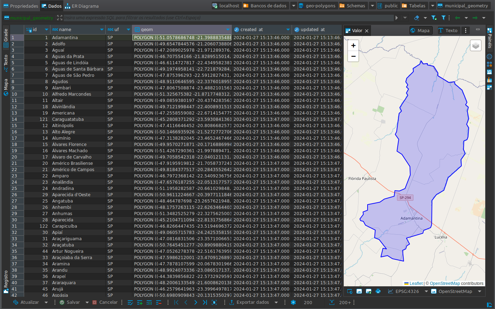
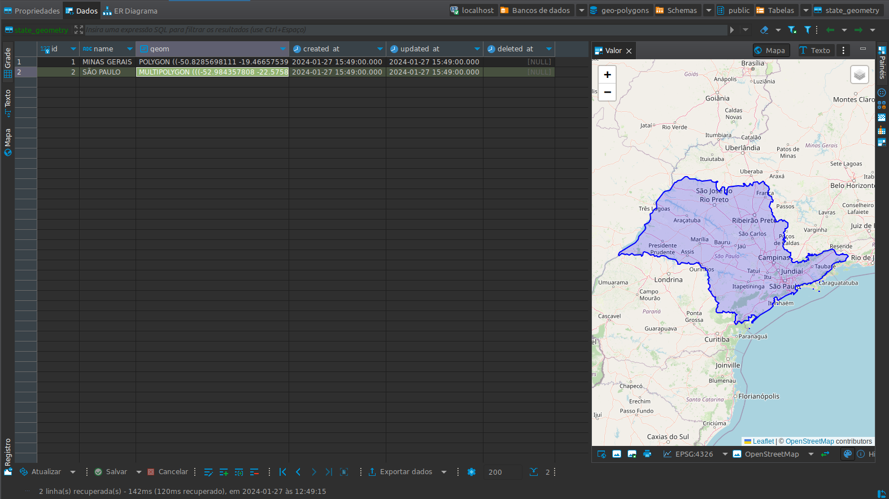
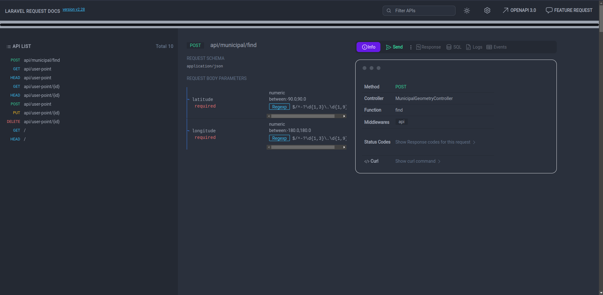

## About

TerraQ - Backend test. This test was created to assess your skills in developing a backend application
that integrates geospatial functionalities. The goal is to create an API that interacts with a
PostgreSQL database with the PostGIS extension, providing endpoints for the manipulation and querying
of geospatial data.
Created some items like Contracts, Seeders, Dependency Injection, Docker in Laravel 10.


## Objectives:
1) Install and Configure PostGIS on PostgreSQL;
2) Set up the PostgreSQL environment with PostGIS in Laravel migrations. This should be done to prepare the database for geospatial operations;
3) Create Geospatial Feature Tables

- Table **municipal_geometry**: To store the geometries of municipalities in São Paulo (SP) and Minas Gerais (MG).
  Municipalities should be created from the provided GeoJSONs. This table should have the fields "id," "name"
  (municipality name), and "geom" (geometry).
- Table **state_geometry**: To store the geometries of states São Paulo (SP) and Minas Gerais (MG).
  This table should be created by processing the data from each state's municipalities and performing
  a join/dissolve to form the state's geometry. This table should have the fields "id," "name" (state name),
  and "geom."
  Create the **state_geometry** and **municipal_geometry** tables using the **GeoJSONs** of São Paulo municipalities
  and the GeoJSONs of Minas Gerais municipalities as inputs.
- Table **pontos_usuario**: To store points posted by users, with fields for "id," "latitude," "longitude,"
  "municipal_id" (municipality ID), and "geom."
- PS: The geometry columns of the created tables should be of type Geometry, have the name "geom," and be in SRID 4326.
4) Develop Specific Endpoints:

- Location Query by Latitude and Longitude (/api//municipal/find): Endpoint to receive latitude and longitude and return the corresponding municipality or an error if not found.
- CRUD for Points (/api/user-point): Implement a complete CRUD to manipulate the "user_points" table, with the methods POST, GET, PUT, DELETE.

## Solution

Made using the Laravel 10 framework, PostgreSQL database with
PostGIS(PostGIS extends the capabilities of the PostgreSQL relational database
by adding support for storing, indexing, and querying geospatial data.) and
Docker for application containerization.

## How to run the project

After downloading the **geo-polygons** repository, being in its main folder, go up the structure composed of the following containers:

- **geo-polygons-back:** Composed with nginx and PHP, being exposed to port `9000`;
- **geo-polygons-postgres:** With the PostgreSQL database.

1) Through the following commands:
```sh 
docker-compose build
```
```sh 
docker-compose up -d
```

After finishing the creation of the containers, we must execute the commands below so that the environment is ready to be used:

1. Used to populate the database with the necessary tables of the solution:
   ```sh 
   docker exec -ti geo-polygons-back php artisan migrate
   ```
2. Used to populate the tables (Required):
   ```sh 
   docker exec -it  geo-polygons-back php artisan db:seed --class=MunicipalGeometrySeeder
   ```
   
   ```sh 
   docker exec -it  geo-polygons-back php artisan db:seed --class=StateGeometrySeeder
   ```
   

Now we can use the application through the address "http://127.0.0.1:9000/request-docs/"
If you want to run the application later, check if the `geo-polygons-back` container is active
executing the following command (Remembering that the same can/must be applied to the container
from the database):

```sh
docker container ls -a
```
If you want to start the `geo-polygons-back` container, run the following command:
```sh
docker container start geo-polygons-back
```
If you want to stop the `geo-polygons-back` container, run the following command:
```sh
docker container stop geo-polygons-back
```

